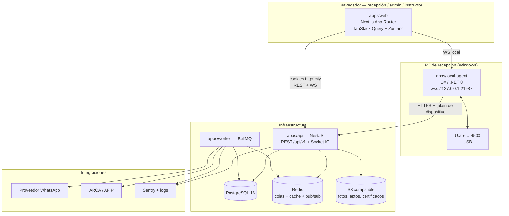
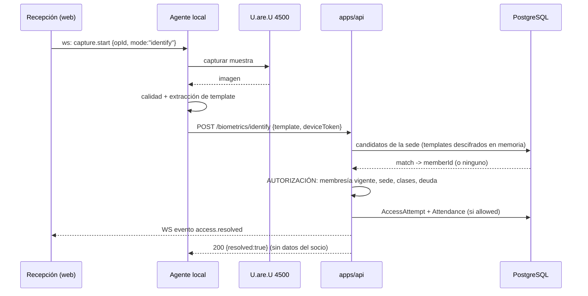
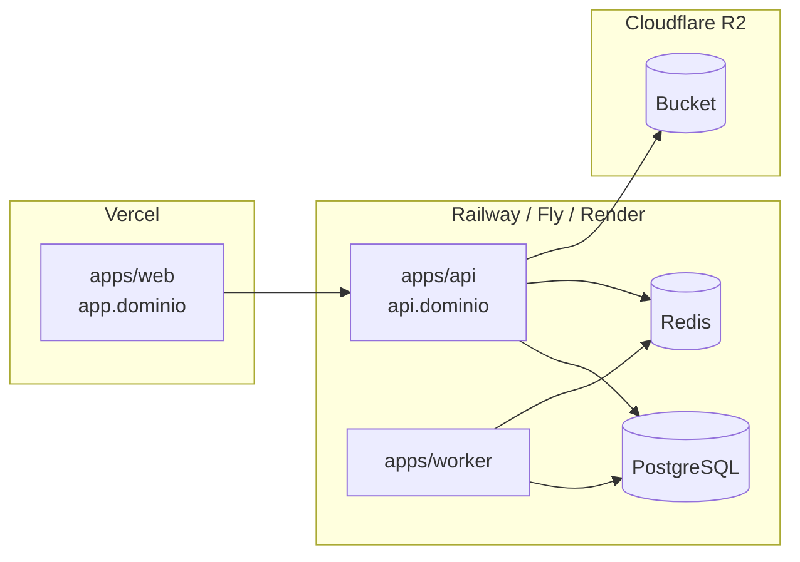

# Arquitectura objetivo — Pulso CRM

Fecha: 2026-08-09
Estado: propuesto.
Decisiones que sustentan este documento: `ADRS.md`.

## 1. Qué es esto

Un CRM/SaaS multi-tenant y multi-sede para gimnasios. Un monolito modular en el backend, una app web, un worker de jobs y un agente local de Windows para el hardware biométrico. Sin microservicios.

## 2. Diagrama general



### Regla de flujo biométrico

El agente **identifica candidatos, no autoriza**. Nunca decide si un socio entra.



El agente recibe únicamente "se resolvió"; los datos del socio (nombre, foto, estado) llegan a la pantalla de recepción por el WebSocket **del backend**, no por el agente. Así el agente nunca maneja PII del padrón.

## 3. Aplicaciones

### 3.1 `apps/web` — Next.js App Router

- Panel operativo. Server Components sólo para layout y shell; todo dato de negocio se consume por TanStack Query desde Client Components (ADR-004).
- Estado de servidor: TanStack Query. Estado de UI y sesión activa (sede seleccionada, sidebar, caja abierta): Zustand **sin persistir tokens**.
- Formularios: react-hook-form + Zod de `packages/contracts`.
- Route Handlers de Next: sólo un proxy fino `/bff/*` cuando haga falta reenviar cookies. Sin lógica de negocio.
- Guards de ruta por permiso y por feature del plan, con el backend como autoridad real.

### 3.2 `apps/api` — NestJS, monolito modular

Un módulo por bounded context. Cada módulo expone controllers, servicios de dominio y repositorios; ningún módulo importa el repositorio de otro — se comunican por servicios públicos o por eventos.

```
src/
  main.ts
  app.module.ts
  common/            # guards, interceptores, filtros, decoradores, paginación
    auth/            # JwtGuard, PermissionsGuard, FeatureGuard, TenantContext
    audit/           # @Audited(), interceptor de auditoría
    idempotency/     # @Idempotent(), store
    money/           # serializador Decimal, validadores
    time/            # helpers de timezone por sede
    errors/          # filtro global, catálogo de códigos
  modules/
    auth/            # login, refresh, logout, me, selección de sede
    tenancy/         # Gym, Branch, SystemConfig, FeatureFlag
    iam/             # User, Role, Permission
    members/         # Member, MedicalCertificate, foto, cuenta corriente
    catalog/         # Plan, Activity
    memberships/     # Membership, ciclo de vida, vencimientos
    cash/            # CashRegister, CashSession, CashMovement, PaymentMethod, CashConcept
    payments/        # cobro de cuota, pago de deuda, reintegro
    access/          # AccessAttempt, Attendance, validación de ingreso
    biometrics/      # LocalAgent, AccessDevice, BiometricCredential/Enrollment/Consent, matching
    scheduling/      # ScheduleSlot, ScheduleException, Reservation
    pos/             # Product, ProductCategory, StockMovement, Sale
    messaging/       # MessageTemplate, MessageJob, MessageLog, proveedor WhatsApp
    training/        # Instructor, Exercise, Routine, MemberRoutine
    loyalty/         # LoyaltyConfig, PointLedgerEntry, RewardRedemption
    reporting/       # estadísticas y dashboard
    billing/         # ARCA
    assistant/       # IA
    platform/        # admin global del SaaS, planes, resellers
    realtime/        # gateway Socket.IO
    health/          # /health/live, /health/ready
  infra/
    prisma/          # PrismaService + extensión de tenant
    redis/
    storage/         # S3
    outbox/          # publicación de eventos de dominio
```

**Orden de guards en cada request:** `JwtAuthGuard` → `TenantContextGuard` (fija `gymId` y sedes permitidas desde la sesión) → `FeatureGuard` → `PermissionsGuard` → `ThrottlerGuard`.

### 3.3 `apps/worker` — BullMQ

Colas y su razón de ser:

| Cola | Jobs | Reintentos |
|---|---|---|
| `messaging` | envío de WhatsApp, broadcast | exponencial, 5 intentos, DLQ |
| `memberships` | vencimiento diario, aviso previo | 3 |
| `loyalty` | objetivo semanal, expiración de puntos | 3 |
| `billing` | emisión ARCA, reintento | 5, DLQ |
| `outbox` | despacho de eventos de dominio | infinito con backoff |
| `maintenance` | limpieza de idempotencia, particiones de auditoría | 1 |

Todo job es idempotente y lleva `jobId` determinístico (`gymId:tipo:referencia:fecha`) para que un re-encolado no duplique efectos.

### 3.4 `apps/local-agent` — C# / .NET 8 (Windows)

Fuera del workspace de pnpm. Detalle completo en `biometrics/LOCAL_AGENT_ARCHITECTURE.md`. Resumen:

- Servicio de Windows + icono de bandeja opcional.
- Servidor WebSocket **sólo en `127.0.0.1:21987`**, con validación de `Origin` contra una allowlist configurada.
- Autenticación por token de dispositivo de corta vida emitido por el backend.
- Sólo captura, mide calidad y extrae template. **No almacena templates. No decide accesos.**

## 4. Paquetes compartidos

| Paquete | Contiene | Lo consume |
|---|---|---|
| `packages/contracts` | Esquemas Zod de request/response, tipos inferidos, códigos de error, enums de dominio, constantes de permisos | web, api, worker |
| `packages/db` | Schema Prisma, cliente generado, extensión de tenant, seeds | api, worker |
| `packages/ui` | Design tokens propios, componentes shadcn/ui personalizados, iconografía | web |
| `packages/config` | Validación de env con Zod, helpers de tiempo/timezone, formateo de dinero y documento | web, api, worker |
| `packages/eslint-config` | Reglas compartidas | todos |
| `packages/tsconfig` | Bases de TS | todos |

**Regla de dependencias:** `contracts` y `config` no dependen de nada del monorepo. `db` depende de `config`. `ui` depende de `config`. `web` no importa `db` **nunca**.

## 5. Base de datos

- PostgreSQL 16. Un esquema, una base, multi-tenant por columna `gymId` (ADR-008).
- Aislamiento en dos capas: extensión de Prisma ahora, RLS después (ADR-009).
- Dinero en `numeric(14,2)` (ADR-010).
- Instantes en `timestamptz` UTC; cortes de día en la zona de la sede (ADR-021).
- Soft delete sólo donde el negocio lo pide (socios, usuarios, productos): `deletedAt`. **Nunca** en tablas financieras ni de auditoría.
- Detalle en `DATA_MODEL.md`.

## 6. Redis

Tres usos, con prefijos separados para poder observarlos y limpiarlos por separado:

| Prefijo | Uso |
|---|---|
| `bull:*` | colas BullMQ |
| `cache:*` | features del plan por gimnasio, permisos por rol, catálogos |
| `socket.io#*` | adapter de Socket.IO |
| `rl:*` | rate limiting |

## 7. Archivos

S3 compatible (R2 por defecto). Bucket por ambiente, prefijo `gym/{gymId}/...`. Subida por **URL prefirmada** emitida por la API tras validar permiso, tipo MIME y tamaño. Lectura por URL prefirmada de corta vida — nunca objetos públicos, porque incluyen fotos de socios y certificados médicos.

## 8. Realtime

Socket.IO montado en la API. Namespace `/gym/{gymId}`, room por sede `branch:{branchId}`, room por usuario `user:{userId}`. Handshake autenticado con la misma cookie de sesión.

Eventos del MVP:

```
access.resolved         # resultado de un intento de ingreso
cash.session.updated    # apertura/cierre/movimiento
agent.status            # agente local conectado/desconectado, lector presente
notification.created
```

## 9. Integraciones externas

| Integración | Cómo entra | Cuándo |
|---|---|---|
| WhatsApp | Interfaz `WhatsAppProvider` en `messaging`; una implementación concreta por proveedor. Envío siempre desde el worker. | Etapa 6 |
| ARCA / AFIP | Módulo `billing` aislado. Certificados cifrados en base, nunca en disco del servidor. | Etapa 13 |
| Sentry | API, worker y web. Scrubbing de PII y de campos biométricos. | Etapa 1 |
| Proveedor de IA | Módulo `assistant`, con acceso sólo a vistas agregadas y con el `gymId` forzado por el servidor. | Etapa 13 |

La abstracción de proveedor de WhatsApp existe desde el primer día para que cambiar de proveedor no toque el dominio.

## 10. Observabilidad

- **Logs** estructurados JSON (pino). Campos fijos: `requestId`, `gymId`, `branchId`, `userId`, `route`, `durationMs`, `status`. Redacción obligatoria de: contraseñas, tokens, cookies, número de documento, teléfono, templates biométricos, certificados.
- **Trazas** de request con `requestId` propagado a worker y a respuestas de error.
- **Métricas** mínimas: latencia p95 por endpoint, tasa de error, profundidad de colas, jobs fallidos, intentos de acceso por resultado, latencia de identificación biométrica.
- **Alertas**: caja cerrada con diferencia > umbral, jobs en DLQ, agente local caído > 15 min en horario operativo, fallo de emisión ARCA, pico de `401`/`403`.

## 11. Seguridad — resumen

Detalle en `SECURITY_MODEL.md`. Titulares:

- Cookies `httpOnly` + refresh rotativo con detección de reuso (ADR-007).
- Tenant desde la sesión, jamás desde headers (ADR-008).
- RBAC con permisos granulares verificados en el backend (ADR-022).
- Rate limiting en login, búsqueda de socios, identificación biométrica, mensajería e IA.
- CSP estricta, `X-Frame-Options`, `Referrer-Policy`, `Permissions-Policy` — la auditoría señaló su ausencia en el producto observado.
- Documento enmascarado por defecto (ADR-018).
- Auditoría append-only (ADR-017).
- Biometría: consentimiento, cifrado en reposo, revocación inmediata, retención definida.

## 12. Despliegue



Web y API comparten dominio padre para que las cookies funcionen con `SameSite=Lax`. Detalle en `DEPLOYMENT_PLAN.md`.

## 13. Qué NO está en esta arquitectura, y por qué

| Excluido | Motivo |
|---|---|
| Microservicios | El brief lo prohíbe explícitamente y el dominio no lo justifica. |
| Firebase / cualquier NoSQL en el camino crítico | ADR-011. Duplica el modelo de autorización. |
| Matching biométrico en el navegador | HID lo desaconseja explícitamente; y el navegador no es confiable. |
| Matching biométrico en el agente como mecanismo primario | ADR-014: revocación diferida inaceptable. |
| GraphQL | Un solo cliente principal; REST + Zod alcanza y es descriptible para el agente .NET. |
| Kubernetes | Complejidad sin retorno en esta escala. |
| Un servicio de realtime aparte | ADR-011. |
