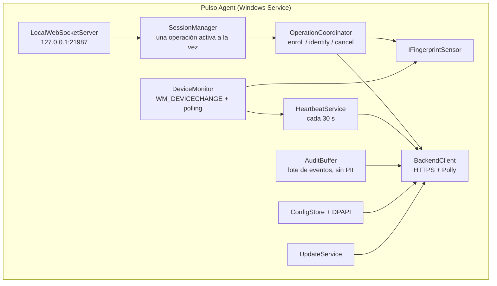
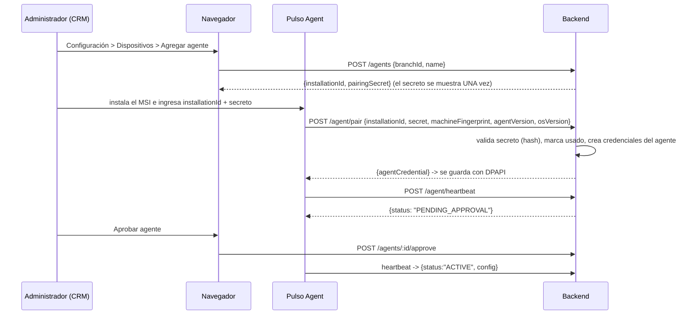
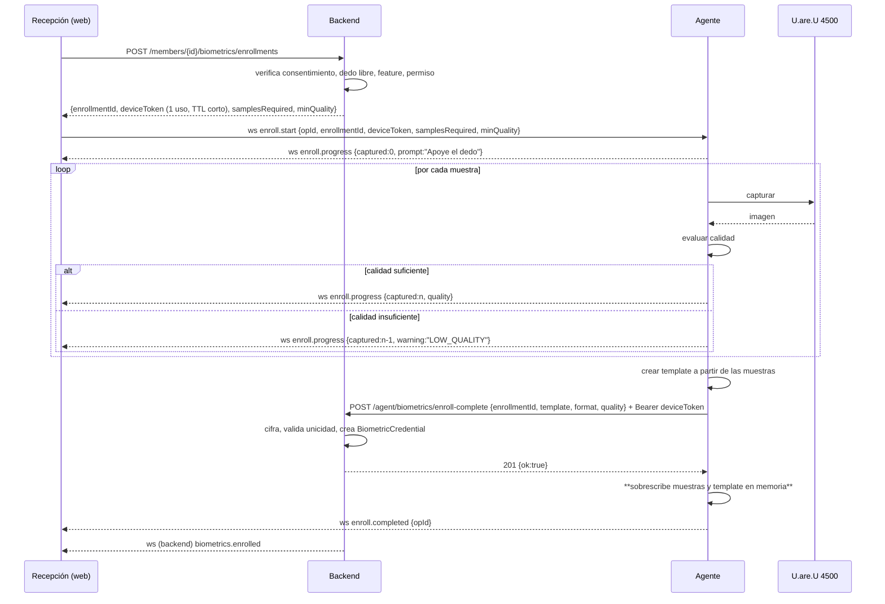
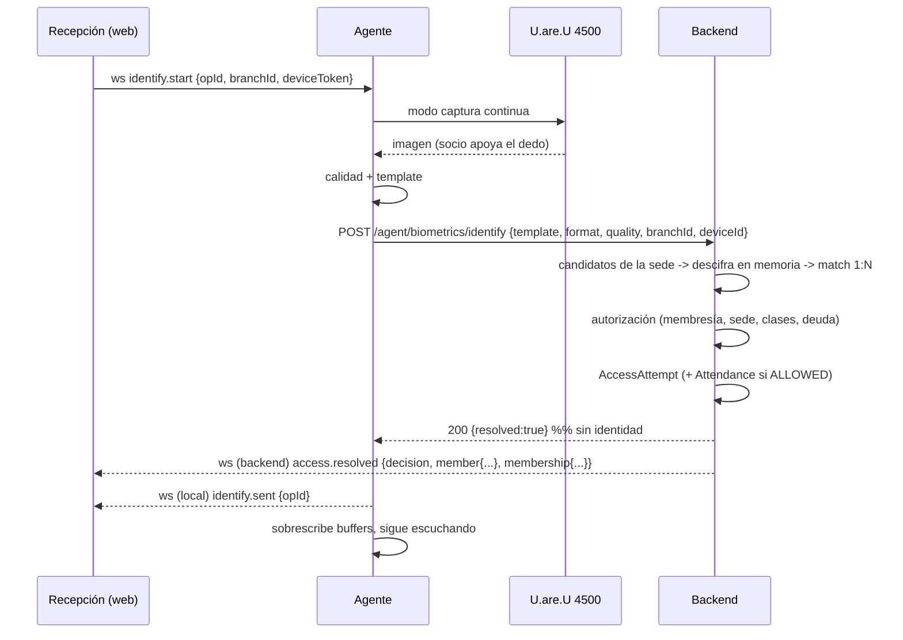

# Arquitectura del agente local — Pulso Agent

Fecha: 2026-08-09
Estado: propuesto. Depende de la POC (Etapa 7) y de cerrar V1/V5 de `UAREU_4500_RESEARCH.md`.

## 1. Qué es y qué no es

El **Pulso Agent** es una aplicación de Windows que traduce entre el hardware biométrico USB y el CRM web. Nada más.

| Es | No es |
|---|---|
| Un puente USB ↔ WebSocket local ↔ HTTPS | Una copia local del CRM |
| Un capturador y extractor de templates | Un motor de decisiones de acceso |
| Un reportero de estado del lector | Un almacén de datos de socios |
| Un ejecutor de operaciones autorizadas por el backend | Un cliente con credenciales permanentes de usuario |

**La regla que define todo el diseño:** el agente **identifica candidatos**; el backend **autoriza**. El agente nunca sabe si un socio tiene la cuota paga, y nunca recibe su nombre.

## 2. Por qué existe

El navegador no puede hablar con un lector USB. Lo confirma el propio fabricante: el stack oficial de HID para web (`@digitalpersona/devices` + `WebSdk`) también requiere un agente local (el *DigitalPersona Agent*) escuchando en loopback. La diferencia es que aquel sólo captura y no hace matching, y está atado a DigitalPersona Identity Server. Ver `UAREU_4500_RESEARCH.md` §5 y ADR-015.

## 3. Tecnología

| Punto | Decisión | Motivo |
|---|---|---|
| Lenguaje | C# | El SDK del lector es nativo Windows con binding primario a .NET/C++ |
| Runtime | .NET 8 LTS, **self-contained, win-x64** | El cliente no instala runtimes; el ejecutable trae el suyo |
| Modo de ejecución | Servicio de Windows + app de bandeja opcional | El servicio arranca sin sesión iniciada; la bandeja da visibilidad al recepcionista |
| Servidor WS | `System.Net.WebSockets` sobre Kestrel, bind exclusivo a `127.0.0.1` | Sin dependencias pesadas |
| HTTP cliente | `HttpClient` con Polly (retry + circuit breaker) | |
| Logging | Serilog a archivo rotativo + envío de eventos al backend | |
| Configuración | `%ProgramData%\Pulso\agent.json` | Legible por el soporte; sin secretos |
| Secretos | **Windows DPAPI**, scope `LocalMachine` | Las credenciales de pareo no van en texto plano |
| Instalador | WiX Toolset → MSI firmado | Ver `INSTALLATION_AND_SUPPORT.md` |

> **Hecho comprobado del entorno:** .NET no está instalado en la máquina de desarrollo actual. Instalarlo es la tarea T-7.1, y el desarrollo del agente requiere además una máquina o VM **Windows** — la de desarrollo es macOS. Esto es una restricción real de la Etapa 7, no un detalle.

### Dependencia de captura y matching

Depende del stack que resulte viable (`UAREU_4500_RESEARCH.md` §4):

- **Stack A**: SDK oficial HID DigitalPersona para Windows → captura, extracción y (opcionalmente) matching.
- **Stack B**: captura vía WBF/driver + FingerJetFX OSE (LGPL-3) para extracción; matching en el backend con SourceAFIS (Apache-2.0).

En ambos casos el **matching 1:N corre en el backend** (ADR-014). Lo que cambia es de dónde sale el template.

La capa de hardware se aísla detrás de una interfaz para poder cambiar de stack sin tocar el resto:

```csharp
public interface IFingerprintSensor {
    Task<IReadOnlyList<SensorInfo>> EnumerateAsync(CancellationToken ct);
    event EventHandler<SensorEventArgs> SensorConnected;
    event EventHandler<SensorEventArgs> SensorDisconnected;
    Task<CaptureResult> CaptureAsync(string sensorId, TimeSpan timeout, CancellationToken ct);
    QualityScore EvaluateQuality(CaptureResult sample);
    Task<TemplateResult> CreateTemplateAsync(IReadOnlyList<CaptureResult> samples, TemplateFormat fmt, CancellationToken ct);
}
```

Implementaciones: `HidDigitalPersonaSensor` (Stack A), `WbfFingerJetSensor` (Stack B), `FakeSensor` (tests y demos sin hardware).

## 4. Componentes internos



| Componente | Responsabilidad |
|---|---|
| `LocalWebSocketServer` | Acepta conexiones **sólo** de loopback. Valida `Origin` contra allowlist. Una conexión activa por vez (la nueva desplaza a la vieja con un `session.replaced`). |
| `SessionManager` | Garantiza **una sola operación de hardware en curso**. Una segunda solicitud recibe `AGENT_BUSY`. |
| `OperationCoordinator` | Máquina de estados de enrolamiento e identificación. Timeouts, cancelación, limpieza. |
| `DeviceMonitor` | Escucha `WM_DEVICECHANGE` y hace polling de respaldo cada 5 s. Publica conexión/desconexión al WS y al backend. |
| `BackendClient` | Único punto que habla con la API. Retry con backoff, circuit breaker, cola en memoria para eventos de auditoría. |
| `HeartbeatService` | `POST /agent/heartbeat` cada 30 s con estado del agente y del lector; recibe configuración vigente y órdenes (`revoked`, `update_available`, `blocked`). |
| `AuditBuffer` | Acumula `AgentAuditEvent` y los envía en lote cada 60 s o al llegar a 50. **Sin datos biométricos ni PII.** |
| `ConfigStore` | Lee `agent.json`; credenciales por DPAPI. |
| `UpdateService` | Verifica firma y hash; aplica sólo en idle y en la ventana permitida. |

## 5. Ciclos de vida

### 5.1 Instalación y pareo



Reglas:

- El secreto de pareo es de **un solo uso** y de vida corta. Se guarda hasheado.
- Un agente recién pareado queda `PENDING_APPROVAL`: **no puede operar** hasta la aprobación explícita de un usuario con `device:manage`.
- `machineFingerprint` es un hash no reversible de identificadores de máquina. Si cambia, el agente vuelve a `PENDING_APPROVAL` (detecta que el binario se copió a otra PC).

### 5.2 Enrolamiento



Puntos críticos:

- Las **muestras crudas nunca salen del agente** ni se escriben a disco. Sólo el template va al backend.
- Al terminar (bien o mal), los buffers se sobrescriben con ceros antes de liberarse.
- Si el WS se cae en medio, el backend expira la `BiometricEnrollment` y **no** queda una credencial a medias.
- El `deviceToken` está atado a `enrollmentId` **y** a `subjectMemberId`: no sirve para enrolar a otro socio.

### 5.3 Identificación



**El agente recibe `{resolved:true}` y nada más.** Toda la información del socio viaja del backend al navegador por el WebSocket del backend, que ya está autenticado con la sesión del usuario.

Por qué importa: si alguien compromete la PC de recepción, no obtiene el padrón ni puede correlacionar huellas con personas desde el agente.

## 6. Máquina de estados del agente

```
                  +----------------+
                  | NOT_CONFIGURED |
                  +----------------+
                          | pareo exitoso
                          v
                  +--------------------+
                  | PENDING_APPROVAL   |
                  +--------------------+
                    | aprobado       | revocado
                    v                v
     +-----------+  hb ok   +--------------+
     |   READY   |<-------->| BACKEND_DOWN |
     +-----------+          +--------------+
       |   ^                       ^
 lector|   | lector conectado      | sin red
 fuera |   |                       |
       v   |                       |
  +---------------+                |
  | NO_DEVICE     |----------------+
  +---------------+
       |
       | operación iniciada
       v
  +-----------+   fin / timeout / cancel
  |   BUSY    |----------------------------> READY
  +-----------+

  Cualquier estado --revocado/blocked--> DISABLED (no opera, muestra motivo)
```

Cada transición emite un `AgentAuditEvent` y se refleja en la barra de estado del CRM.

## 7. Timeouts y límites

| Operación | Timeout | Al vencer |
|---|---|---|
| Captura de una muestra | 20 s | `capture.timeout`, se aborta la operación |
| Sesión de enrolamiento completa | 120 s | `enroll.failed{reason:"TIMEOUT"}`; el backend expira la sesión |
| Modo identificación continua | 300 s de inactividad | `identify.stopped`; la UI puede reactivarlo |
| Request HTTP al backend | 10 s | reintento con backoff (3), luego `BACKEND_DOWN` |
| Handshake WS local | 5 s | se cierra la conexión |
| Ping/pong del WS local | 15 s | se considera muerta y se cierra |
| `deviceToken` | 120 s | el agente pide uno nuevo al frontend |

Límites: **una operación de hardware a la vez**; máximo 5 muestras por enrolamiento; máximo 60 identificaciones por minuto (coincide con el rate limit del backend).

## 8. Reconexión y resiliencia

| Falla | Comportamiento |
|---|---|
| **Lector desenchufado durante la captura** | `DeviceMonitor` detecta `WM_DEVICECHANGE`; se aborta la operación con `DEVICE_DISCONNECTED`; el WS local avisa; la UI muestra "Lector desconectado". Sin cuelgue. |
| **Lector reenchufado** | Se redetecta en < 5 s, se reporta `DEVICE_CONNECTED` al backend y al WS. La operación **no** se reanuda sola: el operador la reinicia (evita capturas fantasma). |
| **Backend caído** | Los heartbeats y eventos de auditoría se acumulan en memoria (máx. 500, luego descarta los más viejos y registra la pérdida). Las identificaciones fallan con mensaje claro: "Sin conexión — usá acceso por DNI". |
| **Navegador cerrado** | El WS local se cae; toda operación en curso se cancela y se limpian los buffers. |
| **Reinicio de Windows** | El servicio arranca solo, relee configuración y credenciales por DPAPI, reenumera el lector, reanuda el heartbeat. **No requiere intervención.** Verificado en POC-18. |
| **Agente revocado** | El heartbeat devuelve `REVOKED`; el agente pasa a `DISABLED`, borra credenciales locales y muestra el motivo. |
| **Versión bloqueada** | Igual que revocado, con instrucciones de actualización. |

## 9. Modo offline

**Decisión del MVP: no hay identificación biométrica offline.** Es consecuencia directa de ADR-014 (matching centralizado): una caché local de templates reintroduce el problema de revocación diferida.

Qué sí funciona sin conexión: el acceso por documento o tarjeta desde el CRM **también requiere backend**, así que la degradación real es operativa — el gimnasio anota manualmente y se registra después con `POST /access/manual-attendance`, que exige motivo y queda auditado.

Si en la Etapa 8 se decide agregar caché local para modo degradado, los requisitos mínimos serán: TTL máximo de 24 h, cifrada con clave derivada por máquina, sólo credenciales de esa sede, revocaciones aplicadas en el primer heartbeat, y todo acceso otorgado offline marcado como `DEGRADED` en `AccessAttempt` para revisión posterior. No se implementa sin esa lista completa.

## 10. Logs del agente

- Archivo rotativo en `%ProgramData%\Pulso\logs\agent-YYYYMMDD.log`, 7 días de retención.
- Niveles: `Debug` sólo si se activa explícitamente para soporte, con expiración automática a las 24 h.
- **Prohibido loguear**: imágenes, templates, `deviceToken`, credenciales, documento del socio, `memberId`.
- Permitido: `opId`, `enrollmentId`, estado del lector, códigos de error, duraciones, calidad numérica.
- Los eventos relevantes se replican al backend como `AgentAuditEvent`.
- Comando de diagnóstico: `pulso-agent --diagnose` genera un ZIP con logs, configuración (sin secretos) y resultado de la detección del lector, para adjuntar a un ticket.

## 11. Seguridad del agente

Detalle en `BIOMETRIC_SECURITY.md`. Titulares:

1. Bind **exclusivo** a `127.0.0.1`. Si no puede, no arranca.
2. `Origin` del WS validado contra allowlist. Un origen no permitido se rechaza en el handshake.
3. Todas las operaciones requieren `deviceToken` de un solo uso emitido por el backend.
4. Credenciales del agente protegidas con DPAPI `LocalMachine`.
5. Sin persistencia de templates ni de imágenes.
6. Buffers sobrescritos al terminar cada operación.
7. Sólo TLS hacia el backend, con validación de certificado (sin `ServerCertificateCustomValidationCallback` permisivo).
8. Binarios firmados; auto-actualización con verificación de firma y hash.
9. El agente no expone ninguna API que devuelva datos del CRM.

## 12. Estructura del proyecto

```
apps/local-agent/
  Pulso.Agent.sln
  src/
    Pulso.Agent.Host/            # servicio Windows, DI, arranque
    Pulso.Agent.Core/            # SessionManager, OperationCoordinator, máquina de estados
    Pulso.Agent.Protocol/        # DTOs del WS, versionado, serialización
    Pulso.Agent.Sensors/
      IFingerprintSensor.cs
      HidDigitalPersonaSensor/   # Stack A
      WbfFingerJetSensor/        # Stack B
      FakeSensor/                # sin hardware
    Pulso.Agent.Backend/         # BackendClient, Polly, heartbeat, auditoría
    Pulso.Agent.Tray/            # app de bandeja (opcional)
  tests/
    Pulso.Agent.Core.Tests/
    Pulso.Agent.Protocol.Tests/
    Pulso.Agent.Integration.Tests/   # con FakeSensor
  installer/
    Pulso.Agent.Installer.wixproj
  README.md
```

Fuera del workspace de pnpm. Build propio (`dotnet build`), pipeline propio. El único punto de contacto con el monorepo es `Pulso.Agent.Protocol`, cuyos DTOs deben mantenerse en sincronía con `packages/contracts/agent-protocol.ts` — hay un test en ambos lados que valida el mismo conjunto de fixtures JSON compartidas en `docs/biometrics/protocol-fixtures/`.

## 13. Qué se construye en cada etapa

| Etapa | Alcance |
|---|---|
| **7 — POC** | Proyecto desechable, fuera del monorepo. Consola, sin instalador, sin seguridad completa. Objetivo: responder GO/NO-GO. |
| **8 — Producción** | Todo lo de este documento. El código de la POC **no se promueve**: se reescribe con la arquitectura definida. La POC es para aprender, no para heredar. |
