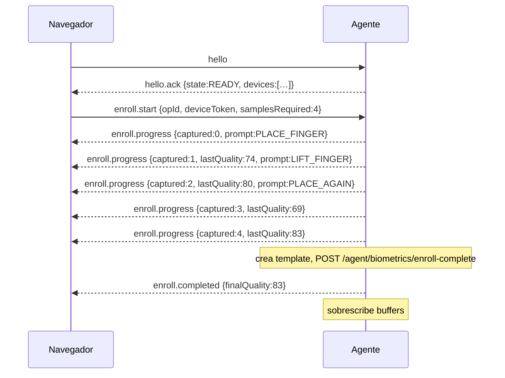
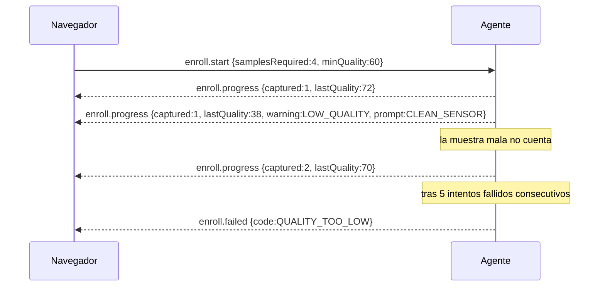

# Protocolo WebSocket local — Pulso Agent

Versión del protocolo: **1.0**
Fecha: 2026-08-09
Estado: propuesto.

## 1. Alcance

Define la conversación entre el **navegador** (frontend del CRM) y el **Pulso Agent** instalado en la misma PC. No cubre la comunicación agente ↔ backend, que es HTTPS y está en `API_CONTRACTS.md` §10.

## 2. Endpoint

```
wss://127.0.0.1:21987/agent/v1
```

| Punto | Valor | Motivo |
|---|---|---|
| Host | `127.0.0.1` exclusivamente | Nunca `0.0.0.0`, nunca `localhost` (puede resolver a `::1` y a interfaces inesperadas según configuración) |
| Puerto | **21987** | No colisiona con el DigitalPersona Agent de HID (`52181`) ni con el puerto del producto auditado (`17890`) |
| Esquema | `wss` | Certificado local; ver §3 |
| Path | `/agent/v1` | La versión mayor va en el path: un cambio incompatible es un path nuevo |

### Fallback a `ws`

Si el certificado local no está instalado, el agente **también** escucha `ws://127.0.0.1:21987/agent/v1`, pero:

- rechaza toda operación de enrolamiento e identificación con `TLS_REQUIRED`;
- sólo permite `hello`, `status.get` y `ping`;
- el CRM muestra un banner rojo "Agente sin TLS — reinstalar el certificado".

Es decir, el fallback sirve para diagnosticar, no para operar. Se documenta esto porque el producto auditado hace fallback silencioso de `wss` a `ws`, y ese es exactamente el patrón que no queremos.

## 3. TLS local

Un certificado en `127.0.0.1` es un problema conocido: el navegador exige un certificado en el que confíe.

**Decisión:** el instalador genera un certificado autofirmado para `127.0.0.1` (válido 2 años) y lo instala en el almacén **Trusted Root** de la máquina. Es una operación local, con consentimiento explícito durante la instalación, y el desinstalador lo remueve.

- Clave privada protegida con DPAPI, no exportable.
- El certificado es **único por instalación** (no se distribuye una clave compartida en el MSI — ese sería un fallo grave: cualquiera con el MSI podría suplantar al agente en otra máquina).
- Renovación automática 30 días antes del vencimiento.
- Alternativa evaluada y descartada: un dominio público `agent.pulso.app` apuntando a `127.0.0.1` con certificado real. Funciona, pero ata el agente a que ese dominio siga resolviendo y a la renovación centralizada de un certificado cuya clave privada habría que distribuir. Peor.

## 4. Handshake

### 4.1 Validación de `Origin`

El agente rechaza el upgrade si `Origin` no está en la allowlist configurada (`agent.json`, escrita por el instalador):

```json
{ "allowedOrigins": ["https://app.pulso.app", "http://localhost:3000"] }
```

`http://localhost:3000` sólo se agrega en instalaciones marcadas como desarrollo.

Rechazo: HTTP `403` en el upgrade, sin cuerpo. Se registra `AgentAuditEvent(AUTH_FAILED, "ORIGIN_REJECTED")`.

### 4.2 Una conexión por vez

El agente acepta **una** conexión activa. Al llegar una nueva:

1. envía `session.replaced` a la vieja,
2. cancela cualquier operación en curso,
3. cierra la vieja con código `4001`,
4. acepta la nueva.

Motivo: dos pestañas del CRM peleándose por el lector es una fuente de bugs imposibles de reproducir.

## 5. Formato de mensaje

Todos los mensajes, en ambas direcciones:

```json
{
  "v": "1.0",
  "id": "01J9X...",
  "type": "enroll.start",
  "ts": "2026-08-09T14:30:00.123-03:00",
  "correlationId": "01J9W...",
  "payload": { }
}
```

| Campo | Obligatorio | Notas |
|---|---|---|
| `v` | sí | Versión del protocolo. Si el mayor no coincide, el agente responde `error{code:"PROTOCOL_VERSION_UNSUPPORTED"}` y cierra |
| `id` | sí | UUID v7 del mensaje |
| `type` | sí | ver §6 |
| `ts` | sí | ISO-8601 con offset |
| `correlationId` | en respuestas | `id` del mensaje que originó esta respuesta |
| `payload` | según tipo | |

Reglas:

- Un `type` desconocido se responde con `error{code:"UNKNOWN_MESSAGE_TYPE"}` y **no** cierra la conexión (compatibilidad hacia adelante: un cliente nuevo puede mandar tipos que un agente viejo no conoce).
- Un campo desconocido dentro de un `payload` conocido se **ignora** (compatibilidad hacia adelante).
- Tamaño máximo de mensaje: 256 KB. Uno mayor cierra la conexión con `4009`.

### Versionado

- **Mayor** (`1.x` → `2.x`): incompatible. Path nuevo (`/agent/v2`). El agente puede servir ambos durante una transición.
- **Menor** (`1.0` → `1.1`): aditivo. Mismo path.
- El backend soporta las **dos últimas versiones menores**. Una anterior recibe `426 UPGRADE_REQUIRED` en el heartbeat y el CRM avisa que hay que actualizar el agente.

## 6. Catálogo de mensajes

### 6.1 Cliente → Agente

#### `hello`
Primer mensaje tras el upgrade. Sin él, el agente rechaza cualquier otro tipo.

```json
{ "type": "hello", "payload": {
  "clientVersion": "1.4.2",
  "gymId": "uuid",
  "branchId": "uuid",
  "userAgent": "..." }}
```

`gymId`/`branchId` son **informativos para el log**. El agente no los usa para autorizar nada: la autoridad es el `deviceToken` que valida el backend.

#### `status.get`
Sin payload. Pide el estado actual.

#### `enroll.start`

```json
{ "type": "enroll.start", "payload": {
  "opId": "uuid",
  "enrollmentId": "uuid",
  "deviceToken": "opaque",
  "deviceId": "uuid",
  "samplesRequired": 4,
  "minQuality": 60,
  "fingerPosition": "RIGHT_INDEX",
  "timeoutMs": 120000 }}
```

El `deviceToken` viene del backend (`POST /members/:id/biometrics/enrollments`). El frontend lo **pasa**, no lo guarda.

#### `identify.start`

```json
{ "type": "identify.start", "payload": {
  "opId": "uuid",
  "deviceToken": "opaque",
  "deviceId": "uuid",
  "branchId": "uuid",
  "minQuality": 50,
  "continuous": true,
  "idleTimeoutMs": 300000 }}
```

`continuous: true` deja el lector escuchando: el socio apoya el dedo y el flujo se dispara solo. Es el modo normal de recepción.

#### `identify.stop`
```json
{ "type": "identify.stop", "payload": { "opId": "uuid" } }
```

#### `operation.cancel`
```json
{ "type": "operation.cancel", "payload": { "opId": "uuid", "reason": "USER_CANCELLED" } }
```
Cancela la operación en curso. El agente aborta la captura, limpia buffers y responde `operation.cancelled`. **Siempre debe funcionar**, incluso con el lector colgado (el timeout de captura es la red de seguridad).

#### `ping`
Sin payload. El agente responde `pong`. Cada 15 s.

---

### 6.2 Agente → Cliente

#### `hello.ack`

```json
{ "type": "hello.ack", "payload": {
  "protocolVersion": "1.0",
  "agentVersion": "1.0.3",
  "agentState": "READY",
  "tls": true,
  "devices": [{
    "deviceId": "uuid",
    "kind": "FINGERPRINT_READER",
    "vendor": "HID_DIGITALPERSONA",
    "model": "UAREU_4500",
    "serialNumber": "…",
    "status": "ONLINE" }] }}
```

Si `agentState` es `PENDING_APPROVAL`, `DISABLED` o `NOT_CONFIGURED`, el payload incluye `reason` y el CRM muestra qué hacer.

#### `status`
Mismo payload que `hello.ack`. Se emite ante `status.get` y de forma espontánea cuando cambia el estado.

#### `device.connected` / `device.disconnected`
```json
{ "type": "device.disconnected", "payload": { "deviceId": "uuid", "reason": "USB_REMOVED" } }
```

#### `enroll.progress`

```json
{ "type": "enroll.progress", "payload": {
  "opId": "uuid",
  "captured": 2,
  "required": 4,
  "lastQuality": 78,
  "prompt": "PLACE_FINGER",
  "warning": null }}
```

`prompt` es un **código**, no texto para el usuario: `PLACE_FINGER`, `LIFT_FINGER`, `PLACE_AGAIN`, `PRESS_HARDER`, `CENTER_FINGER`, `CLEAN_SENSOR`. El CRM lo traduce. Así el copy vive en un solo lugar y se puede localizar.

`warning`: `LOW_QUALITY`, `PARTIAL_IMAGE`, `SAME_AS_PREVIOUS`, `null`.

#### `enroll.completed`
```json
{ "type": "enroll.completed", "payload": { "opId": "uuid", "enrollmentId": "uuid", "finalQuality": 82 } }
```
Se emite **después** de que el backend confirmó. El template ya está guardado y cifrado.

#### `enroll.failed`
```json
{ "type": "enroll.failed", "payload": { "opId": "uuid", "code": "TIMEOUT", "detail": "…" } }
```

#### `identify.captured`
```json
{ "type": "identify.captured", "payload": { "opId": "uuid", "quality": 71 } }
```
Feedback inmediato: "leí tu dedo". La UI muestra un pulso visual antes de que llegue el resultado del backend.

#### `identify.sent`
```json
{ "type": "identify.sent", "payload": { "opId": "uuid" } }
```
El template se envió al backend. **El resultado NO viene por acá**: llega al navegador por el WebSocket del backend (`access.resolved`). El agente nunca conoce la identidad.

#### `identify.failed`
```json
{ "type": "identify.failed", "payload": { "opId": "uuid", "code": "QUALITY_TOO_LOW" } }
```

#### `operation.cancelled`
```json
{ "type": "operation.cancelled", "payload": { "opId": "uuid", "reason": "USER_CANCELLED" } }
```

#### `session.replaced`
```json
{ "type": "session.replaced", "payload": { "reason": "NEW_CONNECTION" } }
```

#### `error`
```json
{ "type": "error", "payload": { "code": "AGENT_BUSY", "detail": "…", "opId": "uuid|null" } }
```

#### `pong`
Sin payload.

## 7. Códigos de error

| Código | Significado | Qué hace la UI |
|---|---|---|
| `PROTOCOL_VERSION_UNSUPPORTED` | Versión mayor incompatible | "Actualizá el agente" |
| `UNKNOWN_MESSAGE_TYPE` | Tipo desconocido | log; no interrumpe |
| `HELLO_REQUIRED` | Se mandó algo antes del `hello` | error de programación; log |
| `TLS_REQUIRED` | Operación sensible sobre `ws://` | banner "Reinstalar certificado" |
| `AGENT_NOT_CONFIGURED` | Sin parear | link a la guía de instalación |
| `AGENT_PENDING_APPROVAL` | Esperando aprobación | "Pedile a un administrador que apruebe este puesto" |
| `AGENT_DISABLED` | Revocado o versión bloqueada | muestra el motivo |
| `AGENT_BUSY` | Otra operación en curso | "Esperá a que termine la operación anterior" |
| `NO_DEVICE` | Sin lector | "Conectá el lector" |
| `DEVICE_ERROR` | Falla del SDK/driver | "Problema con el lector" + botón de diagnóstico |
| `DEVICE_DISCONNECTED` | Se desconectó durante la operación | "Se desconectó el lector" |
| `QUALITY_TOO_LOW` | No se alcanzó la calidad mínima | "Volvé a intentar; limpiá el sensor" |
| `TIMEOUT` | Venció el timeout | "Se agotó el tiempo" |
| `INVALID_TOKEN` | `deviceToken` inválido, vencido o ya usado | pide uno nuevo al backend y reintenta **una** vez |
| `BACKEND_UNREACHABLE` | Sin conexión con la API | "Sin conexión — usá acceso por DNI" |
| `BACKEND_REJECTED` | El backend rechazó (409/422) | muestra el error del backend |
| `INTERNAL_ERROR` | Falla no clasificada | "Error del agente" + diagnóstico |

## 8. Códigos de cierre del WebSocket

| Código | Motivo |
|---|---|
| `1000` | Cierre normal |
| `4001` | Reemplazado por otra conexión |
| `4003` | `Origin` rechazado |
| `4004` | `hello` no recibido dentro de 5 s |
| `4008` | Ping/pong perdido |
| `4009` | Mensaje demasiado grande |
| `4010` | Versión de protocolo incompatible |

## 9. Diagramas de secuencia

### 9.1 Enrolamiento feliz



### 9.2 Calidad insuficiente y reintento



### 9.3 Desconexión USB durante la identificación

```mermaid
sequenceDiagram
  participant C as Navegador
  participant A as Agente
  C->>A: identify.start {continuous:true}
  A-->>C: (esperando)
  Note over A: WM_DEVICECHANGE — lector removido
  A-->>C: device.disconnected {reason:USB_REMOVED}
  A-->>C: identify.failed {code:DEVICE_DISCONNECTED}
  Note over A: estado -> NO_DEVICE
  Note over A: lector reconectado
  A-->>C: device.connected
  A-->>C: status {state:READY}
  Note over C: la UI habilita el botón; NO reanuda sola
```

### 9.4 Token vencido

```mermaid
sequenceDiagram
  participant C as Navegador
  participant A as Agente
  participant API as Backend
  C->>A: identify.start {deviceToken: T1}
  A->>API: POST /agent/biometrics/identify (Bearer T1)
  API-->>A: 401 INVALID_DEVICE_TOKEN
  A-->>C: error {code:INVALID_TOKEN, opId}
  C->>API: pide un token nuevo
  API-->>C: {deviceToken: T2}
  C->>A: identify.start {deviceToken: T2}
  Note over C: un solo reintento automático; si falla otra vez, se muestra el error
```

## 10. Reglas de implementación para el cliente web

1. **Nunca persistir `deviceToken`.** Se pide, se usa, se descarta. No va a `localStorage`, `sessionStorage`, Zustand persistido ni URL.
2. Reconexión con backoff exponencial (1 s, 2 s, 4 s, 8 s, máx. 30 s) y jitter. Sin reintentos infinitos y agresivos: la PC de recepción tiene otras cosas que hacer.
3. `ping` cada 15 s; si no llega `pong` en 10 s, cerrar y reconectar.
4. Al desmontar la pantalla de acceso, enviar `identify.stop` y cerrar limpio.
5. Todo mensaje entrante se valida con Zod (`packages/contracts/agent-protocol.ts`). Un mensaje inválido se descarta y se loguea; **nunca** se confía en el shape.
6. El estado del agente se refleja en la UI de forma permanente (badge en el header), no sólo cuando falla.
7. El resultado de la identificación se escucha en el **WebSocket del backend**, no en el del agente. Un desarrollador que espere el resultado por el WS local está implementando mal la separación identificación/autorización.

## 11. Fixtures compartidas

`docs/biometrics/protocol-fixtures/` contiene un JSON por tipo de mensaje, con un ejemplo válido y varios inválidos.

- El agente (.NET) tiene un test que deserializa cada fixture válida y rechaza cada inválida.
- El frontend (TypeScript) tiene el test espejo con Zod.

Si alguien cambia el protocolo de un lado sin el otro, **los dos tests fallan**. Es el único mecanismo que mantiene sincronizados dos lenguajes distintos sin generación de código.

## 12. Lo que este protocolo deliberadamente no hace

| No hace | Por qué |
|---|---|
| Enviar datos del socio al agente | El agente no necesita saber quién es nadie |
| Devolver el resultado del acceso por el WS local | La autorización es del backend y viaja por su propio canal autenticado |
| Permitir que el agente consulte el padrón | Sería el peor punto de fuga posible |
| Aceptar conexiones remotas | Sólo loopback |
| Guardar templates del lado del cliente | Nunca salen del flujo captura → backend |
| Reintentar operaciones de hardware automáticamente | Una captura fantasma es peor que un reintento manual |
